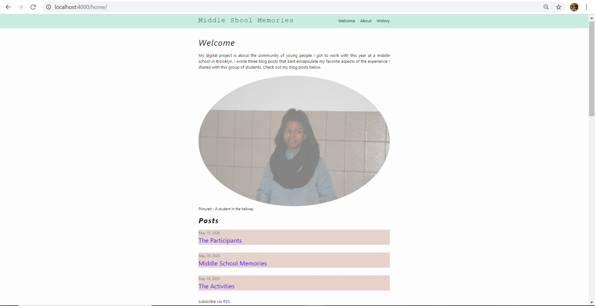
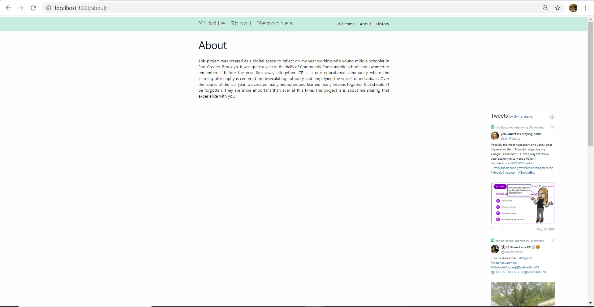
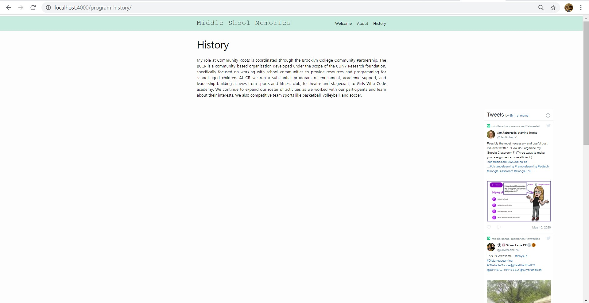
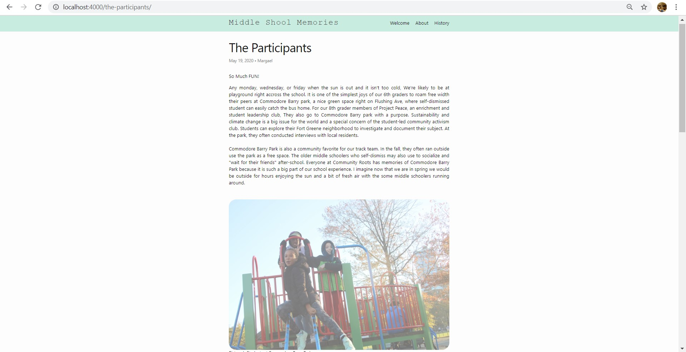
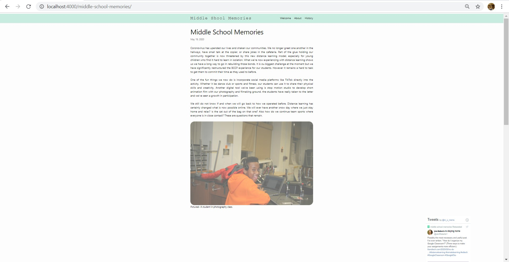
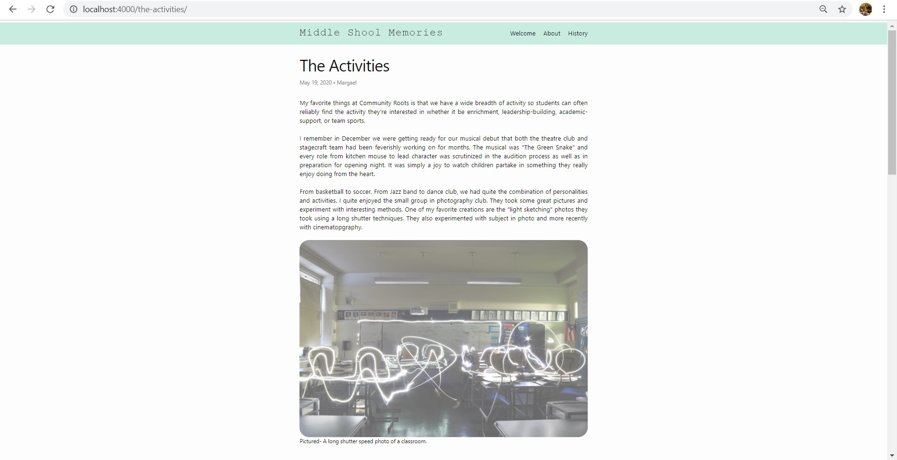
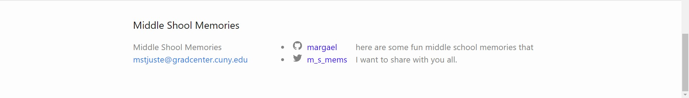
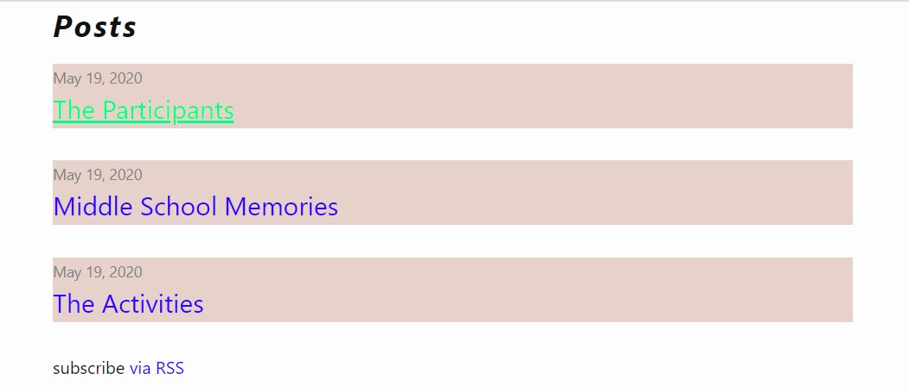

<html>
Margael St Juste

May 23rd, 2020

Software Design Lab

Final Reflection
    <body>
    

        I proposed to use jekyll to generate a static blog site as a space to reflect on my year working at a middle school in Brooklyn.
        This project was very challenging for me. I knew there would inevitably be issues that arise as I attempted to build the site but I did not anticipate coming accross so many problems. 
        After I create the site, the first thing I tried to do was select a new theme. That proved to be the initial challenge. I spent way to much time troubleshooting this problem to not have arrived at a satisfactory conclusion. It was impossible to get the theme that I wanted because my version of ruby did not support the gems that I needed. I faced the decision to dowload an older version of ruby or stick with the given theme.
        Once, I was able to locate my layout and includes folders, things got easier. I play around with some elements. I installed a twitter feed using some javascript code I sourced from another project of mine. i changed the navigation and post listing for my site. I used my main.scss file to add css elements such as background color, font-style, text-align, font-weight. And quickly my site started looking a little less plain. At one point my custom css code had dissapeared and I had to go back and rewrite everything.
        I then added inline html tags to the posts and figure elements containing images and figcaptions. I basically did all the things I discussed in the project readme <a href="https://github.com/margael/shebuilds" here </a>

        There's a lot more I wanted to do with the site that I haven't been able to do yet. I'm hoping that over the summer I will improve with practice and familiarizing myself with what is required to build a static site. 
        Troubleshooting has been one of the most frustrating aspects of this because I spent a lot more hours doing that than anything else and I don't always find what I'm looking for. As a Windows user, I also feel that Windows OS is a more challening environment to build a static site. 

        Now my biggest challenge is hosting the site on github pages. I tried to host it 3 different time and everytime the pages have not rendered with the html/css. I'm not really sure what to do anymore. As a human being who's been really trying to create something I've never done before and having been met with so many challenges, I've reached the point where for my own mental health, I am choosing to submit this project as if even though it isn't what I want it to be.
        I really hope that you will read the code and let me know what I need to fix because searching the internet for answers has not yeilded much in my case. so what i am going to do is embed screencaptures of my site from the local host  server so that you can see what it would have looked like had the pages been properly rendered.
    

    

        The website has three pages and 3 blog posts and and embedded twitter feed. The blog posts are accessible from the welcome page. The pages are accessible from the navigation bar in the header. Here are some captures from the site.
        <figure>
            
            <figcaption font-weight:bold>fig 1. This is a screencapture of the welcome page.</figcaption>
        </figure>
        <figure>
            
            <figcaption font-weight:bold>fig 1. This is a screencapture of the about page.</figcaption>
        </figure>
        <figure>
            
            <figcaption font-weight:bold>fig 1. This is a screencapture of the welcome page.</figcaption>
        </figure><figure>
            
            <figcaption font-weight:bold>fig 1. This is a screencapture of the history page.</figcaption>
        </figure><figure>
            
            <figcaption font-weight:bold>fig 1. This is a screencapture of the blog post titled The Participants.</figcaption>
        </figure>
        <figure>
            
            <figcaption font-weight:bold>fig 1. This is a screencapture of the blog post titled Middle School Memories.</figcaption>
        </figure>
        <figure>
            
            <figcaption font-weight:bold>fig 1. This is a screencapture of the blog post titled The Activities.</figcaption>
        </figure><figure>
            
            <figcaption font-weight:bold>fig 1. This is a screencapture of the footer.</figcaption>
        </figure>
        <figure>
            
            <figcaption font-weight:bold>fig 1. This is a screencapture of the hover effect on the links.</figcaption>
        </figure>
    

    </body>
</html>

